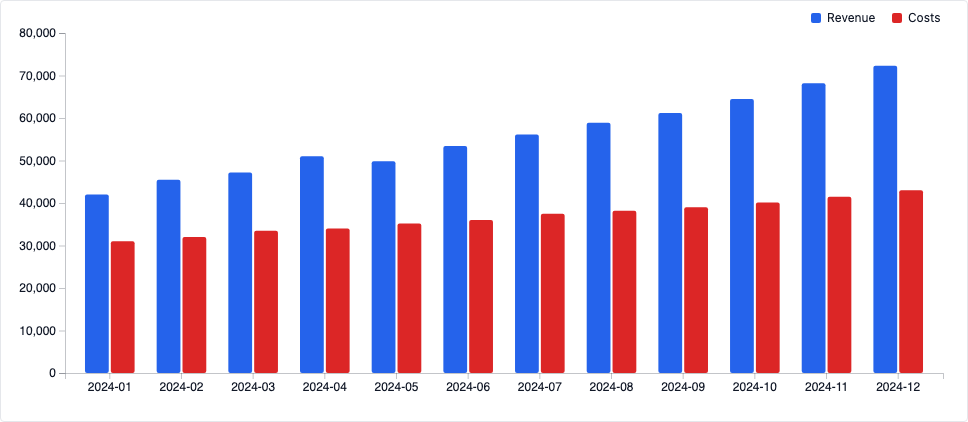
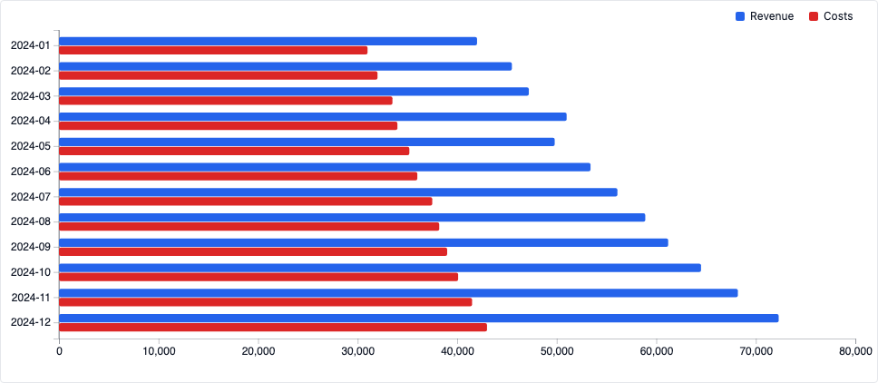
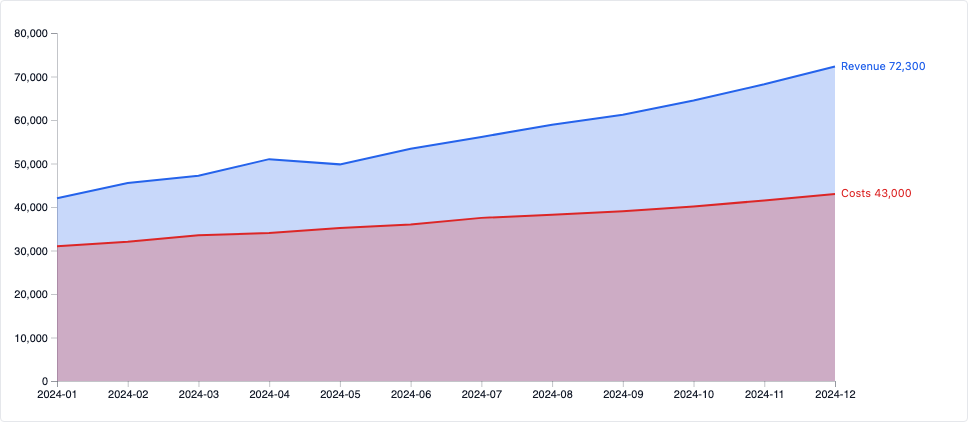
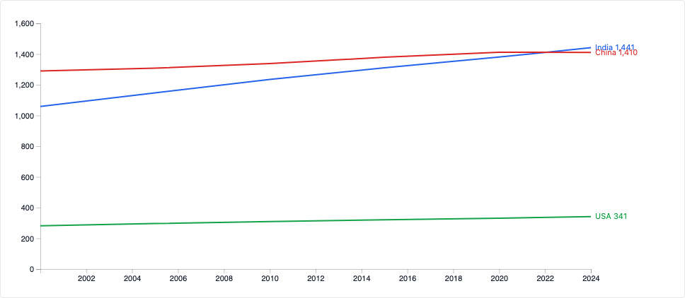

# Inkline

A browser-based, **frontend-only** tool: upload or paste data, pick a chart type, style it,
and export/embed a static, responsive, accessible visualization — no server required to use it.

Datawrapper-style tool built with SvelteKit + TypeScript + D3, following [`INKLINE-SPEC.md`](./INKLINE-SPEC.md).

> Name note: "Inkline" collides with an existing Vue.js UI library at `github.com/inkline` —
> going with it anyway, just don't expect the plain `inkline` npm package name to be free.

|  |  |
|---|---|
|  |  |
|  |  |

## Status

**Phase 1 (MVP) is implemented and verified working end-to-end:**

- Data: CSV/XLSX upload, paste-from-Excel, bundled sample datasets, editable data grid with
  per-column type detection/override (§3)
- Charts: Bar, Column, Line, Area — with date-axis auto-detection, smooth/linear interpolation,
  area fill, point dots, log scale, direct end-of-line labels with mobile legend fallback,
  tooltips, and a legend (§4/§5)
- Style: title/subtitle/source/footer, palette, legend toggle, dark mode, responsive vs. fixed size (§6)
- Export: PNG (1x/2x/transparent), JPEG, SVG, PDF, self-contained interactive HTML with
  postMessage auto-resize, iframe embed snippet, copy-to-clipboard, and CSV/XLSX/JSON data
  export — all client-side (§8/§9)
- Local library: chart projects persist to IndexedDB via Dexie (§10)

**Not yet built** (see `INKLINE-SPEC.md` §16 for the full phase plan): the rest of the chart
catalog (pie/donut, scatter, table, maps, histogram, box plot, etc.), the full annotation/label-
collision system, themes-as-files, i18n/RTL, keyboard shortcuts & command palette, PDF batch
export, and export presets.

## Why frontend-only

Everything that makes the *editor and renderer* useful (data grid, chart engine, styling,
annotations, export) runs entirely client-side — parsing (PapaParse/SheetJS), rendering (D3),
persistence (IndexedDB/Dexie), and every export format (canvas for PNG/JPEG, DOM serialization
for SVG, jsPDF+svg2pdf.js for PDF). The build output is static files you host anywhere
(GitHub Pages, Netlify, Vercel, S3). See `INKLINE-SPEC.md` §14 for what was deliberately cut
(accounts, short share links, live data refresh) and why.

## Developing

```sh
npm install
npm run dev -- --open
```

## Building

```sh
npm run build   # outputs a static site to ./build
npm run preview # preview the production build locally
```

## Type-checking

```sh
npm run check
```
